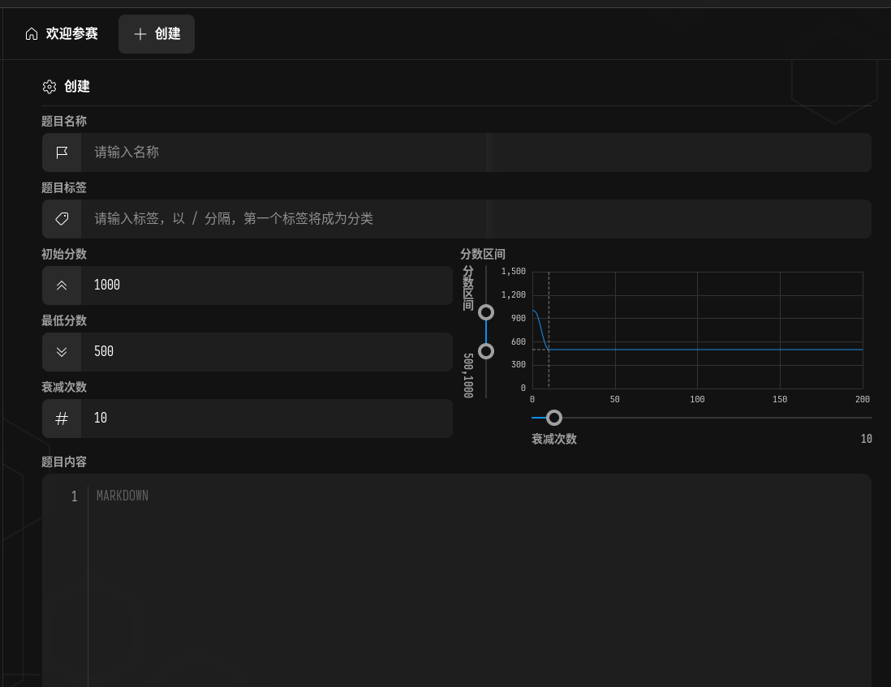
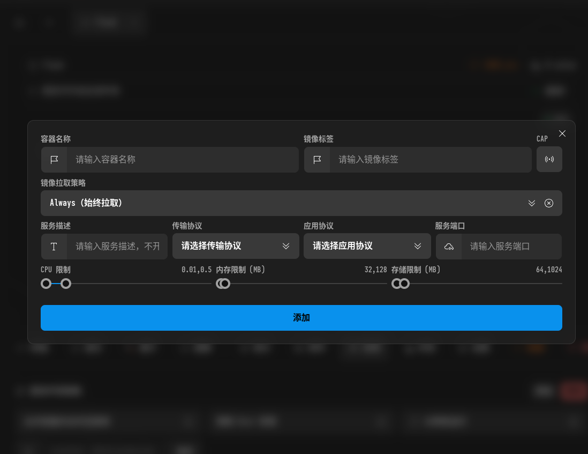
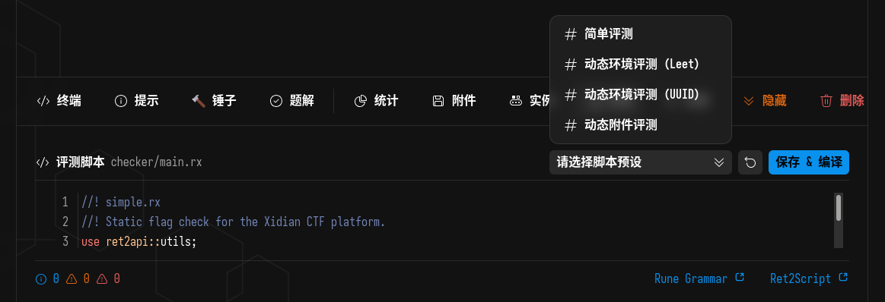
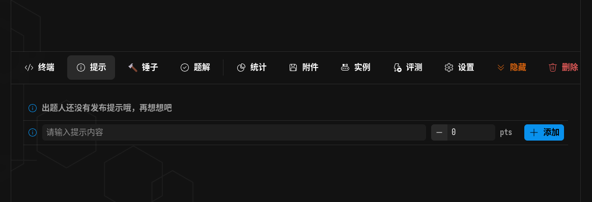

# ret2shell 上题指南（FAQ）

这个文档用于说明`ret2shell`平台上题的步骤，节约学习试错成本

## 题目信息



题目标签：作为分类题目的依据，统一起见，请使用小写方向名字，例如：`web`，`pwn`等

### 实例镜像



容器名称：**这个并不是容器地址**，而是你给该容器起的名字，可以随意或按照自己的习惯

镜像标签：这个就是容器地址，填写即可。例如：`ghcr.io/xuantianctf/hctf-2026/web-request`

拉取策略：一般选择`Always`即可

服务描述：随意即可


### 评测（flag验证方案）



这个是非常客制化的方案，一般情况下直接选择预设脚本即可

**动态flag: **一个是根据用户UUID生成的，另一个`Leet`则是根据算法生成相似但是可以追溯用户的flag

动态flag会写入到`FLAG`环境变量中，出题时候需要注意

`简单评测：`这个则需要去修改一下脚本

```rust
//! * simple.rx
//! Static flag check.

use ret2api::utils;
use ret2api::regex;

/// check the flag in regex format, only apply to content without prefix
const ENABLE_REGEX = false;
/// case sensitive
const CASE_SENSITIVE = true;
/// the flag prefix, the game name for example, `flag` means the flag will be `flag{...}`
const PREFIX = "flag";    /// !!!!!! 这里是flag前缀
/// the flag template (readable recommended), used to generate the correct flag content
/// if regex enabled, the template is like `^you_.+_impact$`
const TEMPLATE = "building_perfect_beach_walk_experience";  /// ！！！！！这个是flag里面的内容

/// Check flag submitted by user.
///
/// * bucket: the challenge `ret2api::bucket::Bucket` object
/// * user: { id: number, account: string, institute_id: number }
/// * team: { id: Option<number>, name: Option<string>, institute_id: Option<number> }
/// * submission: { id: number, user_id: number, team_id: Option<number>, challenge_id: number, content: string }
///
/// Returns: Result<(bool, string, Option<{peer_team: i64, reason: string}>), any>
/// means (correct, msg, audit: { peer_team, reason }), when audit is not None, the team will be treated as cheated,
/// and the platform will publish a event to administrators.
///
/// The audit message will be validate again in the platform, so don't worry about false positives.
pub async fn check(bucket, user, team, submission) {
  let flag = utils::Flag::parse(submission.content)?;
  if flag.prefix() != PREFIX {
    return Ok((false, `Wrong format! flag should be ${PREFIX}{...}`, None));
  }

  if ENABLE_REGEX {
    if regex::test(TEMPLATE, flag.content())? {
      Ok((true, "Correct!", None))
    } else {
      Ok((false, "Incorrect!", None))
    }
  } else if CASE_SENSITIVE {
    if flag.content() == TEMPLATE {
      Ok((true, "Correct!", None))
    } else {
      Ok((false, "Incorrect!", None))
    }
  } else {
    if utils::lower(flag.content()) == utils::lower(TEMPLATE) {
      Ok((true, "Correct!", None))
    } else {
      Ok((false, "Incorrect!", None))
    }
  }
}

/// Provides the environment variables when user starts the challenge container.
///
/// * bucket: the challenge `ret2api::bucket::Bucket` object
/// * user: { id: number, account: string, institute_id: number }
/// * team: { id: Option<number>, name: Option<string>, institute_id: Option<number> }
///
/// Returns: Result<#{ [key: string]: string }, any>
pub async fn environ(bucket, user, team) {
  Ok(#{})
}

```

由于简单评测脚本是面向`静态flag`的情况，所以要修改上面的对应两行代码即可

### 提示



增加游戏趣味性的功能

用户可以选择是否查看提示，但是需要消耗对应的分数，这个可以根据情况设置


### 锤子

这个功能`不是`面向出题人的，是面向选手的

选手可以使用*锤子*向在对应题目上面做反馈（例如题目出现问题或出现非预期解答等）
