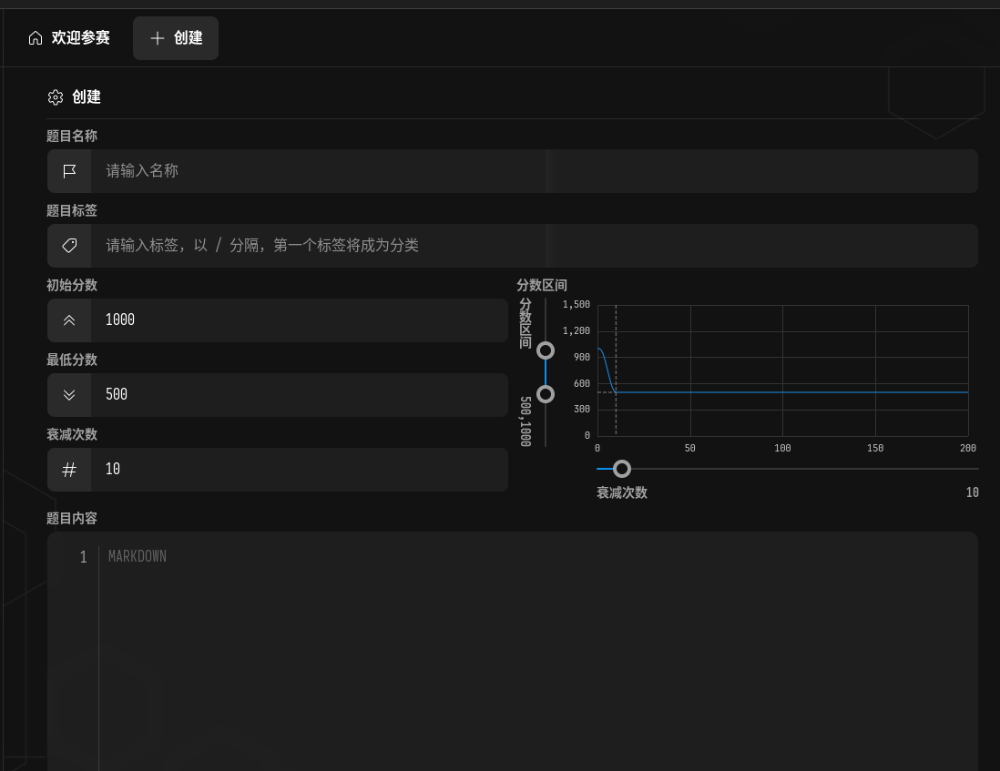
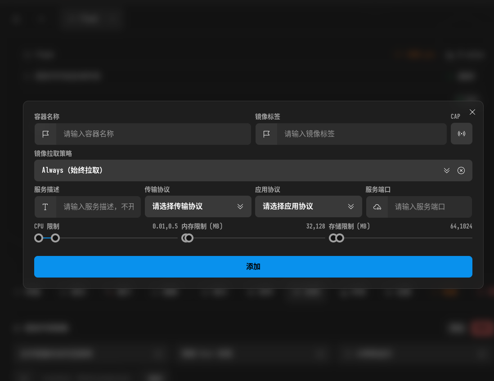
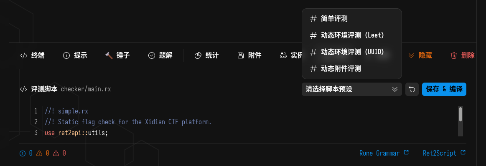
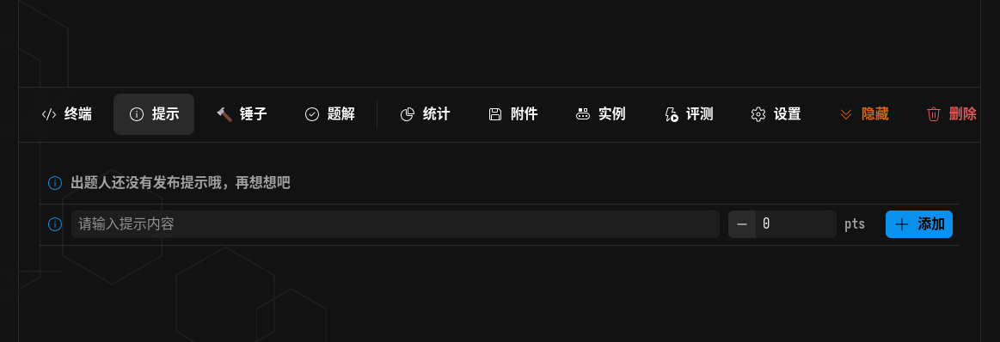

# ret2shell 上题指南（FAQ）

这个文档用于说明`ret2shell`平台上题的步骤，节约学习试错成本

## 题目信息



题目标签：作为分类题目的依据，统一起见，请使用小写方向名字，例如：`web`，`pwn`等

### 实例镜像



容器名称：**这个并不是容器地址**，而是你给该容器起的名字，可以随意或按照自己的习惯

镜像标签：这个就是容器地址，填写即可。例如：`ghcr.io/xuantianctf/hctf-2026/web-request`

拉取策略：一般选择`Always`即可

服务描述：随意即可


### 评测（flag验证方案）



这个是非常客制化的方案，一般情况下直接选择预设脚本即可

**动态flag: **一个是根据用户UUID生成的，另一个`Leet`则是根据算法生成相似但是可以追溯用户的flag

动态flag会写入到`FLAG`环境变量中，出题时候需要注意

`简单评测：`这个则需要去修改一下脚本

```rust
//! * simple.rx
//! Static flag check.

use ret2api::utils;
use ret2api::regex;

/// check the flag in regex format, only apply to content without prefix
const ENABLE_REGEX = false;
/// case sensitive
const CASE_SENSITIVE = true;
/// the flag prefix, the game name for example, `flag` means the flag will be `flag{...}`
const PREFIX = "flag";    /// !!!!!! 这里是flag前缀
/// the flag template (readable recommended), used to generate the correct flag content
/// if regex enabled, the template is like `^you_.+_impact$`
const TEMPLATE = "building_perfect_beach_walk_experience";  /// ！！！！！这个是flag里面的内容

/// Check flag submitted by user.
///
/// * bucket: the challenge `ret2api::bucket::Bucket` object
/// * user: { id: number, account: string, institute_id: number }
/// * team: { id: Option<number>, name: Option<string>, institute_id: Option<number> }
/// * submission: { id: number, user_id: number, team_id: Option<number>, challenge_id: number, content: string }
///
/// Returns: Result<(bool, string, Option<{peer_team: i64, reason: string}>), any>
/// means (correct, msg, audit: { peer_team, reason }), when audit is not None, the team will be treated as cheated,
/// and the platform will publish a event to administrators.
///
/// The audit message will be validate again in the platform, so don't worry about false positives.
pub async fn check(bucket, user, team, submission) {
  let flag = utils::Flag::parse(submission.content)?;
  if flag.prefix() != PREFIX {
    return Ok((false, `Wrong format! flag should be ${PREFIX}{...}`, None));
  }

  if ENABLE_REGEX {
    if regex::test(TEMPLATE, flag.content())? {
      Ok((true, "Correct!", None))
    } else {
      Ok((false, "Incorrect!", None))
    }
  } else if CASE_SENSITIVE {
    if flag.content() == TEMPLATE {
      Ok((true, "Correct!", None))
    } else {
      Ok((false, "Incorrect!", None))
    }
  } else {
    if utils::lower(flag.content()) == utils::lower(TEMPLATE) {
      Ok((true, "Correct!", None))
    } else {
      Ok((false, "Incorrect!", None))
    }
  }
}

/// Provides the environment variables when user starts the challenge container.
///
/// * bucket: the challenge `ret2api::bucket::Bucket` object
/// * user: { id: number, account: string, institute_id: number }
/// * team: { id: Option<number>, name: Option<string>, institute_id: Option<number> }
///
/// Returns: Result<#{ [key: string]: string }, any>
pub async fn environ(bucket, user, team) {
  Ok(#{})
}

```

由于简单评测脚本是面向`静态flag`的情况，所以要修改上面的对应两行代码即可

#### 有关flag头(重点)

ret2shell默认flag头是`flag`,在checker脚本中,需要手动设定

```rust
const prefix = "HCTF"
```

需要注意

### 提示



增加游戏趣味性的功能

用户可以选择是否查看提示，但是需要消耗对应的分数，这个可以根据情况设置


### 锤子

这个功能`不是`面向出题人的，是面向选手的

选手可以使用*锤子*向在对应题目上面做反馈（例如题目出现问题或出现非预期解答等）


## 有关容器配置

`ret2shell`平台支持一个题目多个镜像

一个题目可以包含**一个或多个镜像**。这些镜像会作为一个整体同时启动，共同构成题目环境，并对外提供服务。

每个镜像就是一个独立的容器，可以单独设置：

- 使用的镜像与版本
- 资源配额（CPU / 内存 / 存储）
- 是否对外暴露端口
- 端口协议与应用协议
- 权限与安全限制

常见用途：

- **前后端分离**：Web 前端 + 后端 API + 数据库
- **代理 / 边车**：业务容器 + 审计、日志、代理容器
- **多协议服务**：同时提供 HTTP 与 TCP 服务
- **依赖服务**：为题目附带内部数据库、消息队列等

添加镜像:
点击 **Add** 按钮，在弹窗中填写以下内容：

1. **Container Name**：容器名，同一题目内必须唯一
2. **Image Tag**：选择仓库与版本
3. **Pull Policy**：镜像拉取策略（Always / IfNotPresent / Never）
4. **CAP**：是否限制该容器的 Root 权限
5. **Service 配置**（可选）：服务描述、传输协议、应用协议、端口
6. **资源限制**：CPU、内存、存储

> 只要填写了端口，就必须同时填写服务描述、传输协议与应用协议。

提交后，镜像会出现在下方列表中。重复以上步骤即可添加多个镜像。

### 多场景说明

#### 场景一：多镜像，多端口

前后端分离，两者都需对外访问：分别为 Web 前端与 API 服务各配置一个端口。

#### 场景二：多镜像，单端口（推荐用于依赖服务）

只保留一个对外入口，其余容器不配置端口，仅内部使用：

- Web 入口：配置端口
- 后台任务 / 数据库：不配置端口

#### 场景三：单镜像，单端口

普通题目，只使用一个镜像并配置一个端口即可。


### 容器之间的通信

同一题目的所有容器位于**同一网络环境**中，可通过 `localhost` / `127.0.0.1` 互相访问，无需经过外部网络。

例如场景二：

- 对外入口访问后台服务：连接 `localhost:<服务端口>`
- 后台服务访问数据库：连接 `localhost:<数据库端口>`

**重要约束：**

- 所有容器共享同一网络环境，**不能监听相同端口**，否则题目无法启动
- 只有配置了端口的容器才会对外暴露
- 未配置端口的容器仅能在内部通信
- 若要让用户直接访问某个内部服务，必须为其配置端口

